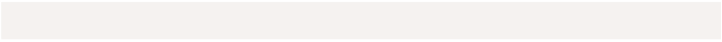
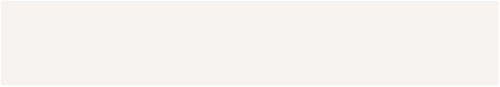
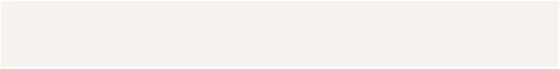



**zetachain crosschain API** ⽂ 档

|Status|In Progress|
| - | - |
|Parent-task|
[后 端 +部 分 索 引](https://www.notion.so/1d8080d974e7801eba99e98de592b63f?pvs=21)

⼯ 作
|

Produce API <https://cross-chain-zetachain-server.zunodex.xyz/>

1. **Quote** 询 价

**URL /api/cross\_chain/routes Method: GET**

**Request Querys:** 

|**name**|**type**|**option**|**description**|
| - | - | - | - |
|fromChainId|number|required|sending chain|
|toChainId|number|required|receiving chain|
|fromTokenAddress|string|required|sending token address|
|toTokenAddress|string|required|receiving token address|
|fromAmount|string|required|sending amount|
|fromAddress|string|required|sending user address|
|toAddress|string|required|receiving user address|
|slippage|number|required|slippage,default: 0.03|

` `https://cross-chain-zetachain-server.zunodex.xyz/api/cross\_chain/routes?fromAddress=0xEaAF29048fdD522aBC73f520 **Response:**

|**name**|**type**|**description**|
| - | - | - |
|routeId|string|route id|
|fromChainId|number|sending chain|
|fromTokenAddress|string|sending token address|
|fromAmount|string|sending amount|
|fromAmountWithOutDecimals|string|sending amount with out decimals|
|fromAmountUSD|string|sending amount usd|
|toChainId|number|receiving chain|
|toTokenAddress|string|receiving token address|
|toAmount|string|receiving amount|
|toAmountWithOutDecimals|string|receiving amount with out decimals|
|toAmountUSD|string|receiving amount usd|
|fromAddress|string|sending user address|
|toAddress|string|receiving user address|
|slippage|number|slippage|
|approveTarget|string|approve target contract|

|fees|object[]|fees|
| - | - | - |
|fees.type|string|fee type. platformFee/destinationFee/btcDepositFee|
|fees.chainId|number|fee chain|
|fees.token|string|fee token address|
|fees.amount|string|fee token amount|
|fees.amountWithOutDecimals|string|fee token amount with out decimals|
|fees.amountUSD|string|fee token amount usd|
|omniPlan|object[]|cross chain steps|
|encodeParams|object|Parameters required for the Transaction Encode API|

**Example Response:**

{

`    `"code" 0,

`    `"msg": "success",

`    `"data": {

`        `"routeId": "9f8eb28459224046-bd7a-1306026ed9e3",

`        `"fromChainId" 11155111,

`        `"fromTokenAddress": "0x1c7D4B196Cb0C7B01d743Fbc6116a902379C7238",         "fromAmount": "2100000",

`        `"fromAmountWithOutDecimals": "2.100000",

`        `"fromAmountUSD": "0.000000",

`        `"toChainId" 7001,

`        `"toTokenAddress": "0xcC683A782f4B30c138787CB5576a86AF66fdc31d",         "toAmount": "2079000",

`        `"toAmountWithOutDecimals": "2.079000",

`        `"toAmountUSD": "0.000000",

`        `"fromAddress": "0xEaAF29048fdD522aBC73f5202256F418898b659a",         "toAddress": "0xEaAF29048fdD522aBC73f5202256F418898b659a",

`        `"slippage" 0.1,

`        `"routeTime" 1748511144982,

`        `"fees": [

`            `{

`                `"type": "platformFee",

`                `"chainId" 7001,

`                `"token": "0xcC683A782f4B30c138787CB5576a86AF66fdc31d",                 "amount": "21000",

`                `"amountWithOutDecimals": "0.021000",

`                `"amountUSD": "0.000000"

`            `}

`        `],

`        `"omniPlan": [

`            `{

`                `"type": "Bridge",

`                `"inChainType": "evm",

`                `"inChainId" 11155111,

`                `"inToken": "0x1c7D4B196Cb0C7B01d743Fbc6116a902379C7238",                 "inAmount": "2100000",

`                `"inAmountWithOutDecimals" 2.1,

`                `"outChainType": "zetachain",

`                `"outChainId" 7001,

`                `"outToken": "0xcC683A782f4B30c138787CB5576a86AF66fdc31d",

`                `"outAmount": "2079000",

`                `"outAmountWithOutDecimals" 2.079,

`                `"feeChainType": "zetachain",

`                `"feeChainId" 7001,

`                `"feeToken": "0xcC683A782f4B30c138787CB5576a86AF66fdc31d",

`                `"feeAmount": "21000",

`                `"feeRateBps" 100

`            `}

`        `],

`        `"approveTarget": "0x2405965a3CB8748D7065752AdC702Bb907AA2297",

`        `"encodeParams": {

`            `"interfaceParams": "eyJyb3V0ZUlkIjoiOWY4ZWIyODQtNTkyMi00MDQ2LWJkN2EtMTMwNjAyNmVkOWUzIiwiZnJv         }

`    `}

}

2. **Transaction Encode** 获 取 上 链 数 据

**URL /api/cross\_chain/transaction/encode Method: POST**

**Request Data:** 

**name type option description**

interfaceParams string required encodParams data returned by the Quote API

**Response:**

**name type description** chainId number sending chain id data string data

to string contract address value string value

from string sending user address

**Example Response:**

{

`    `"code" 0,

`    `"msg": "success",

`    `"data": {

`         `"chainId"  11155111,

`        `"data": "0x3322cdb9000000000000000000000000e70c62baf742140ed5babbcd35f15b7a9811932a000000000000         "to": "0x2405965a3cb8748d7065752adc702bb907aa2297",

`        `"value": "0x0",

`        `"from": "0xEaAF29048fdD522aBC73f5202256F418898b659a"

`    `}

}

3. **Order Create** 保 存 订 单

**URL /api/cross\_chain/order/create**

**Method: POST Request Data:** 

|**name**|**type**|**option**|**description**|
| - | - | - | - |
|fromChainId|number|required|sending chain|
|fromTokenAddress|string|required|sending token address|
|fromAmount|string|required|sending amount|
|fromAmountWithOutDecimals|string|required|sending amount with out decimals|
|fromAmountUSD|string|required|sending amount usd|
|toChainId|number|required|receiving chain|
|toTokenAddress|string|required|receiving token address|
|toAmount|string|required|receiving amount|
|toAmountWithOutDecimals|string|required|receiving amount with out decimals|
|toAmountUSD|string|required|receiving amount usd|
|fromAddress|string|required|sending user address|
|toAddress|string|required|receiving user address|
|slippage|number|required|slippage|
|fromHash|string|required|sending chain hash|
|calldata|string|required|transaction encode data|
|fees|object[]|required|fees data returned by the Quote API|
|omniPlan|object[]|required|omniPlan data returned by the Quote API|

**Response:**

|**name**|**type**|**description**|
| - | - | - |
|success|boolean|Is it successful|

**Example Response:**

{

`    `"code" 0,

`    `"msg": "success",     "data": {

`        `"success": true     }

}

4. **Order List** 历 史 订 单

**URL /api/cross\_chain/order/list Method: GET**

**Request Querys:** 

|**name**|**type**|**option**|**description**|
| - | - | - | - |
|user|string|required|user address|
|type|string|optional|type, defual t: ‘ʼ, select able ： error\_refund|

**Response:**

**name type description **id number order id

|externalId|string|cross chain association id|
| - | - | - |
|fromChainId|string|sending chain|
|toChainId|string|receiving chain|
|fromHash|string|sending chain hash|
|toHash|string|receiving chain hash|
|fromAddress|string|sending user address|
|toAddress|string|receiving user address|
|fromAmount|string|sending amount|
|toAmount|string|receiving amount|
|fromTokenAddress|string|sending token address|
|toTokenAddress|string|receiving token address|
|omniPlan|object[]|cross chain steps|
|fees|object[]|fees|
|slippage|number|slippage|
|fromAmountWithOutDecimals|string|sending amount with out decimals|
|fromAmountUSD|string|sending amount usd|
|toAmountWithOutDecimals|string|receiving amount with out decimals|
|toAmountUSD|string|receiving amount usd|
|refundChainId|string|refund chain|
|refundHash|string|refund hash|
|refundAmount|string|refund amount|
|refundUser|string|refund user|
|refundToken|string|refund token address|
|refundCridgeContract|string|refund contract address|
|startTime|number|cross chain start time|
|endTime|number|cross chain end time|
|status|string|status: pending/success/failure\_revert/abort|
|statusCode|number|status code  0/1/2/3|
|subStatus|string|
sub status: in\_source\_chain/in\_bridge\_chain/in\_destination\_chain/success/wait\_claim\_

refund/refund\_s
|
|createdAt|string|create time|

**Example Response:**

{

`    `"code" 0,

`    `"msg": "success",

`    `"data": {

`        `"list": [

`            `{

`                `"id" 46,

`                `"externalId": "0x7e58e3fa8175a4e08ba37baaeb6912c9d5b813c9b353ee17954cb09da0135a8c",                 "fromChainId": "11155111",

`                `"toChainId": "7001",

`                `"fromHash": "0xe3986a209de8299a0212afe5605a3ccca02a044adcd7e492aa832a235dfc667d",                 "toHash": "0x5376532e5f739b66371d5679f147deb35ec1b4e6b70f7238aca4f832a203b430",                 "fromAddress": "0xF859Fb7F8811a5016e9A5380b497957343f40476",

`                `"toAddress": "0xF859Fb7F8811a5016e9A5380b497957343f40476",

`                `"fromAmount": "1000000",

`                `"toAmount": "990000",

`                `"fromTokenAddress": "0x1c7D4B196Cb0C7B01d743Fbc6116a902379C7238",

`                `"toTokenAddress": "0xcC683A782f4B30c138787CB5576a86AF66fdc31d",

`                `"omniPlan": [

`                    `{

`                        `"hash": "0xe3986a209de8299a0212afe5605a3ccca02a044adcd7e492aa832a235dfc667d",                         "type": "Bridge",

`                        `"inToken": "0x1c7D4B196Cb0C7B01d743Fbc6116a902379C7238",

`                        `"feeToken": "0xcC683A782f4B30c138787CB5576a86AF66fdc31d",

`                        `"inAmount": "1000000",

`                        `"outToken": "0xcC683A782f4B30c138787CB5576a86AF66fdc31d",

`                        `"feeAmount": "10000",

`                        `"inChainId" 11155111,

`                        `"outAmount": "990000",

`                        `"feeChainId" 7001,

`                        `"feeRateBps" 100,

`                        `"outChainId" 7001,

`                        `"hashChainId": "11155111",

`                        `"inChainType": "evm",

`                        `"feeChainType": "zetachain",

`                        `"outChainType": "zetachain",

`                        `"inAmountWithOutDecimals" 1,

`                        `"outAmountWithOutDecimals" 0.99

`                    `}

`                `],

`                `"fees": [

`                    `{

`                        `"type": "platformFee",

`                        `"token": "0xcC683A782f4B30c138787CB5576a86AF66fdc31d",

`                        `"amount": "10000",

`                        `"chainId" 7001,

`                        `"amountUSD": "0.000000",

`                        `"amountWithOutDecimals": "0.010000"

`                    `}

`                `],

`                `"slippage" 0.005,

`                `"fromAmountWithOutDecimals": "1.000000",

`                `"fromAmountUSD": "0.000000",

`                `"toAmountWithOutDecimals": "0.990000",

`                `"toAmountUSD": "0.000000",

`                `"refundChainId": "",

`                `"refundHash": "",

`                `"refundAmount": "",

`                `"refundUser": "",

`                `"refundToken": "",

`                `"refundCridgeContract": "0xe70C62baf742140ED5bAbbCD35f15b7a9811932A",

`                `"startTime" 1748590812,

`        `"endTime" 1748591208,

`                `"status": "success",

`                `"statusCode" 1,

`                `"subStatus": "success",

`                `"createdAt": "20250529T070419.220Z"

`            `}

`        `],

`        `"count" 31,

`        `"page" 1,

`        `"pageSize" 1     }

}

5. **O**rder **detail** 订 单 详 细

**URL /api/cross\_chain/order/detail Method: GET**

**Request Querys:** 

|**name**|**type**|**option**|**description**|
| - | - | - | - |
|fromChainId|number|required|sending chain|
|fromHash|string|required|sending chain hash|

**Response:** Same as the order list interface

6. **T**ransaction **S**tatus** 交 易 状 态

**URL /api/cross\_chain/transaction/status Method: GET**

**Request Querys:** 

|**name**|**type**|**option**|**description**|
| - | - | - | - |
|fromChainId|number|required|sending chain|
|fromHash|string|required|sending chain hash|

**Response:**

|**name**|**type**|**description**|
| - | - | - |
|status|string|status: pending/success/failure\_revert/abort|
|statusCode|number|status code  0/1/2/3|
|subStatus|string|
sub status: in\_source\_chain/in\_bridge\_chain/in\_destination\_chain/success/wait\_claim\_

refund/refund\_success
|
|toChainHash|string|to chain hash|
|refundChainId|string|refund chain id|
|refundHash|string|refund hash|

**Example Response:**

{

`  `"code" 0,

`  `"msg": "success",

`  `"data": {

`    `"status": "success",

`    `"statusCode" 1,

`    `"subStatus": "success",

`    `"toChainHash": "0xe3986a209de8299a0212afe5605a3ccca02a044adcd7e492aa832a235dfc667d",

`    `"refundChainId": "",     "refundHash": ""

`  `}

}

Status Description

**statusCode:**

0 pending  1 success  2 failure\_revert  3 abort

**status:**

|**type**|**description**|
| - | - |
|pending|transaction pending|
|success|transaction success|
|failure\_revert|transaction fails, the transaction amount will be automatically refunded to the user|
|abort|Transaction failed, the transaction amount needs to be claimed by the user|

**subStatus**: 

|**type**|**description**|
| - | - |
|in\_source\_chain|The transaction is still in the source chain|
|in\_bridge\_chain|The transaction is still in the zeta chain|
|in\_destination\_chain|The transaction has reached the target chain|
|success|transaction success|
|wait\_claim\_refund|Waiting for the user to collect the refund amount|
|refund\_success|refund success|

7. **Token List**

**URL /api/cross\_chain/tokenlist Method: GET**

**Request Querys:** 

|**name**|**type**|**option**|**description**|
| - | - | - | - |
|chainId|number|optional||
**Response:**

|**name**|**type**|**description**|
| - | - | - |
|id|number|id|
|name|string|token name|
|address|string|token addres|
|symbol|string|symbol|
|decimals|number|decimals|
|logo|string|icon logo|
|chainId|number|chain id|

**Example Response:**

{

`  `"code" 0,

`  `"msg": "success",

`  `"data": [

`  `{

`  `"id" 4,

`  `"name": "USDC",

`  `"address": "0x75faf114eafb1BDbe2F0316DF893fd58CE46AA4d",

`  `"symbol": "USDC",

`  `"decimals" 6,

`  `"logo": "https://images.dodoex.io/cYegvLr5lcFzE1xLzQlcFHxoXQeK6cI7rdBCnfxAJdE/rs:fit:1601600/g:no/aHR0cHM   "chainId" 421614,

`  `"position" 1,

`  `"slippage": null

}

`  `]

}
zetachain cr osschain API  ⽂ 档 9
